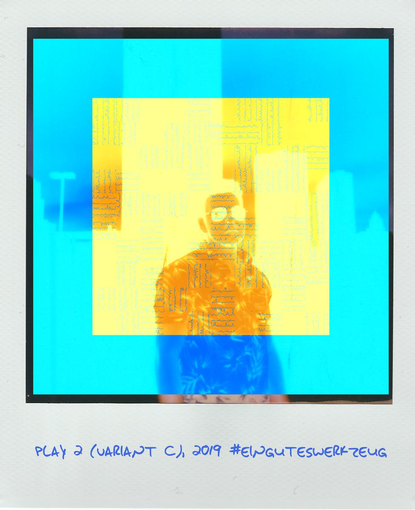

Tip
===

processing filterchains feels a bit like in the 90s of the last century, means
it can get time-consuming. By setting the size to 200*200 pixels
(`--size-inner 200`) and not using any frame (!) (`--noframe`) the runtime
shortens a lot. This is ideal for getting a preview while experimenting with
different settings until a combination produces interesting results which
can then be rendered in high-res:

```console
  $ egw --generator psychedelic --filter pixelsort,mosaic,oil2
        --params-filter '{"algo":10}{"block_size":16}{"brush_size":8, "roughness" : 80}'
        -o /tmp/3.png -s 200 --noframe && feh /tmp/3.png
```

play!
-----

simple things combined and adding some salt (randomness) can produce complex
results. in the following example i got an interesting
result just out of using the --alpha-blend option "wrong" [#]_:

In goes::

  $ egw --generator nlines -o /tmp/2.jpg --filter puzzle
        -c ./einguteswerkzeug/egw.conf
        --template ./einguteswerkzeug/templates/square/roland-deason-tPWHTBzQVIM-unsplash.jpg
        --alpha-blend 2  --border-size 0.5 --border-color 20,145,321
        --title="play 2 (variant C), 2019 #einguteswerkzeug"
        --text-color 65,105,225 -m 1200 && feh /tmp/2.jpg

Out comes:



    HOWTO-2


.. [#] to be honest i didn't read the Pillow documentation well and just
       guessed somehow that the accepted "correct" range is between 0 and 1 -
       where a value of 0.0 stands for fully transparent and a 1.0 for opaque.
       but there's more candy in the box. (:
