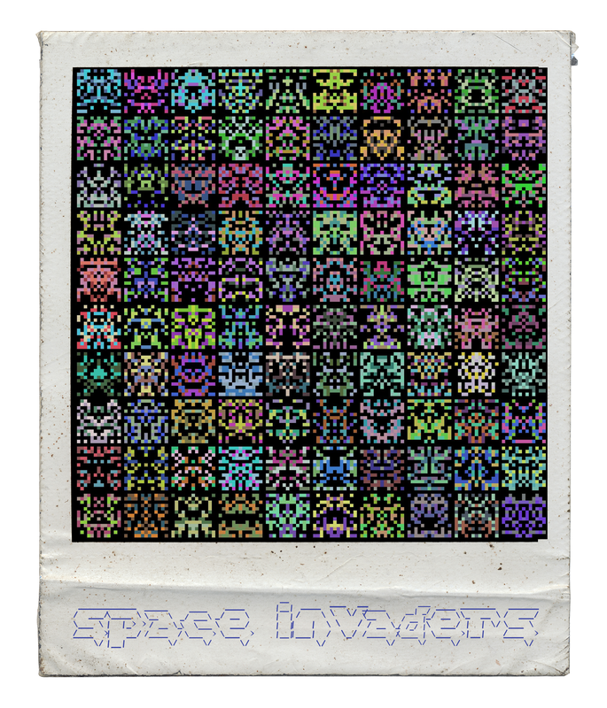

einguteswerkzeug - a creative tool for generative artworks
==========================================================

einguteswerkzeug (`egw`) is a **tool for creating minimalistic visual artworks** in
printing quality - and learning and mixing fun to use technologies
full-stack around it (raspi, webapis, docker, serverless computing, flutter). :)

</img>

`egw` can be used for creating **high-quality art prints**
or just for giving your photos or contactsheets a fairly well & [**individual vintage polaroid style**](README.md) [1](#footnote1). einguteswerkzeug provides some [phonky](https://www.youtube.com/watch?v=TBXv37PFcAQ) **filters and generative art capabilities** mostly based on wonderfull open-source-projects and inspiring blog-articles
around (see credits & thanks). in short the software provides:

* generative-art-"generators" which are fun to play with
* chainable filters (`--filter f1,f2,...,fN`)
* reading & processing EXIF-data
* lightweight plugin-framework - simple to use (and write) filters & generators
* vintage polaroid style supporting (high-res) templates
* supports your favorite [(truetype-)font](https://www.dafont.com)
* `--help`-option :) + usage-examples as shellscripts

`egw` is in **beta-status** and therefore some interface-things will
change for sure - but for now it already works fine for me. Maybe it
can be usefull for you too, especially if you like to tinker with code.

turn einguteswerkzeug into deinguteswerkzeug :)
-----------------------------------------------

It's fun to chain some of the provided filters to get good results
but to get most out of `egw` use its lightweight plugin-mechanism to [simply roll your own **plugin(s)**](https://github.com/s3h10r/egw-plugins) in [Python](https://python.org).

**Contributions are welcome** and they are greatly appreciated!

Please feel free to send a pull-request and use the [issue tracker](https://github.com/s3h10r/polaroidme/issues).

TLDR; show don't tell
---------------------

<!--
</img>
-->
</img>

Some examples of works i am doing with `einguteswerkzeug`:

</img>
</img>

</img>
</img>

</img>
</img>

</img>
</img>

<!--
</img>
-->

</img>
</img>

</img>
</img>

</img>
</img>

</img>
</img>

you want to help?
=================

free high-res templates with "free as in freedom, not as in free beer"
----------------------------------------------------------------------

To get an appealing rugged analogue style which is good enough for large prints high-res
scans of polaroid frames are required. [the ones i use for now (and include the confs for)
can be downloaded here for free](http://www.fuzzimo.com/free-hi-res-blank-polaroid-frames/)
- but they are not licensed under CreativeCommons or alike...
If you own a good scanner and could [provide some high-res scans of polaroid frames](https://github.com/s3h10r/egw-templates) this would be awesome! (:

donate
------

You do like einguteswerkzeug and want to support its development but you don't
have the time? Please **[consider a small donation](https://paypal.me/s3h10r)** - every
cent helps me to pay the bills & to continue building awesome software for
creative people.

Thank you very much!

Credits & Thanks
================

filters
-------
The ASCII-art filter relies on codesnippets from the following Open Source projects:

 - [asciify](https://github.com/RameshAditya/asciify)
 - [ImageToAscii](https://github.com/cleardusk/ImageToAscii/blob/master/img_to_ascii.py)
   Copyright (c) 2018 Jianzhu Guo, MIT License

Most filters are adopted from:
     [https://github.com/Tinker-S/SomeImageFilterWithPython](https://github.com/Tinker-S/SomeImageFilterWithPython)

- The quads-filter is a quickndirty py3-port of the wonderfull code by [Michael Fogleman](https://github.com/fogleman/Quads)

generators
----------

The generator `sprites` is made with [code by Eric Davidson](https://medium.freecodecamp.org/how-to-create-generative-art-in-less-than-100-lines-of-code-d37f379859f).

The generator `psychedelic` is the wonderfull code of ["Random (Psychedelic) Art, and a Pinch of Python" by Jeremy Kun](http://jeremykun.com/2012/01/01/random-psychedelic-art/).

The generator `squares+circles` is heavily [inspired by Kevin Howbrook's Squares](https://medium.com/@kevinhowbrook/learning-python-and-being-creative-making-art-with-code-da02880e3738)

The generator [`mondrian`](https://en.wikipedia.org/wiki/Piet_Mondrian) is an adoption of the  [Nifty Assigment](http://nifty.stanford.edu/) [Mondrian Art - Beautiful Recursion by Ben Stephenson](http://nifty.stanford.edu/2018/stephenson-mondrian-art/) (Stanford University)

**Thank you guys! Live long and prosper!**

All the crap and bugs in the code while quickly porting some old stuff to Py3
is made by me of course. Please feel free to refacture, fix, tinker, ...

changelog
=========

* please see [CHANGELOG.md](./CHANGELOG.md)

License
=======

einguteswerkzeug is made with <3, actively maintained & developed by Sven Hessenmüller.

einguteswerkzeug uses some excellent open source software and snippets - please
take a look at Credits & Thanks for the complete list of codes & inspirations the author
is gratefull for being allowed to use and remix in this software product.

MIT License

Copyright (c) 2019 Sven Hessenmüller <sven.hessenmueller@gmail.com>

Permission is hereby granted, free of charge, to any person obtaining a copy
of this software and associated documentation files (the "Software"), to deal
in the Software without restriction, including without limitation the rights
to use, copy, modify, merge, publish, distribute, sublicense, and/or sell
copies of the Software, and to permit persons to whom the Software is
furnished to do so, subject to the following conditions:

The above copyright notice and this permission notice shall be included in all
copies or substantial portions of the Software.

THE SOFTWARE IS PROVIDED "AS IS", WITHOUT WARRANTY OF ANY KIND, EXPRESS OR
IMPLIED, INCLUDING BUT NOT LIMITED TO THE WARRANTIES OF MERCHANTABILITY,
FITNESS FOR A PARTICULAR PURPOSE AND NONINFRINGEMENT. IN NO EVENT SHALL THE
AUTHORS OR COPYRIGHT HOLDERS BE LIABLE FOR ANY CLAIM, DAMAGES OR OTHER
LIABILITY, WHETHER IN AN ACTION OF CONTRACT, TORT OR OTHERWISE, ARISING FROM,
OUT OF OR IN CONNECTION WITH THE SOFTWARE OR THE USE OR OTHER DEALINGS IN THE
SOFTWARE.

Footnotes
=========

<!-- footnotes -->
<a name="footnote1">[1]</a>: The polaroid style is a feature
used by default because i really love the polaroid style and
find it appealing & usefull for contactsheets and alike - it can be disabled
of course (option `--noframe`).
